

# 🎬 AKR Remotion Inspo Gallery

  
  
  
  

### A curated collection of highly polished, production-ready Remotion prompts and inspirations.

---

## 🚀 Core Video Generators

These 5 core master prompts allow you to generate full, complex videos just by providing a single input (a URL, a topic, a CSV, etc.). 

### What You Need Per Prompt
- **Education Explainer** — Your input: Change the topic in quotes. Claude: Claude researches, scripts, designs, animates.
- **Product Demo + Launch** — Your input: Change the URL. Claude: Claude scrapes branding, takes screenshots, rebuilds UI, creates simulated demo + real screenshot showcase in one video.
- **Google Reviews Testimonial** — Your input: Paste Google Business Profile link. Claude: Claude scrapes real reviews/rating, creates animated testimonial with star animations + review carousel.
- **Avatar + Animated Overlays** — Your input: Drop 9:16 talking-head video in `public/`. Claude: Claude transcribes speech, overlays animated titles/badges/captions on top of your full-frame video.
- **Data Viz Dashboard** — Your input: Drop a CSV in `public/`. Claude: Claude analyzes data, picks chart types, animates.

### 💡 Pro Tips
- **Always start with** "Use the Remotion best practices skill" — already included in every prompt.
- **Visual controls** — Prompts 2 and 4 ask Claude to add position sliders you can tweak in Remotion Studio.
- **Iterate** — After the first render, give correction prompts (”make the bars wider”, “slow the typing to 10 chars/sec”, “change accent color to orange”).
- **Render** — Ask Claude to open “Remotion Studio” so you can preview the video.

### View the Master Prompts
1. [Education Explainer Video](./core-prompts/1-education-explainer.txt)
2. [Product Demo + Launch Video](./core-prompts/2-product-demo.txt)
3. [Google Reviews Testimonial Video](./core-prompts/3-google-reviews.txt)
4. [Avatar Video with Animated Overlays](./core-prompts/4-avatar-overlays.txt)
5. [Data Visualization Infographic](./core-prompts/5-data-viz.txt)

---

## 🎨 Inspiration Gallery

Explore the collection of cinematic animations and dynamic visual components. Click on any preview to view the prompt details!

| Preview | Preview |
| :---: | :---: |
| [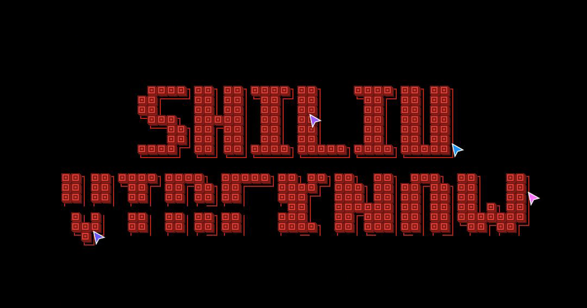](./prompt/3d-retro-pixel-font) **[3D Retro Pixel Font](./prompt/3d-retro-pixel-font)** |  **[Apple Style Device Rise Animation](./prompt/apple-style-device-rise-animation)** |
| [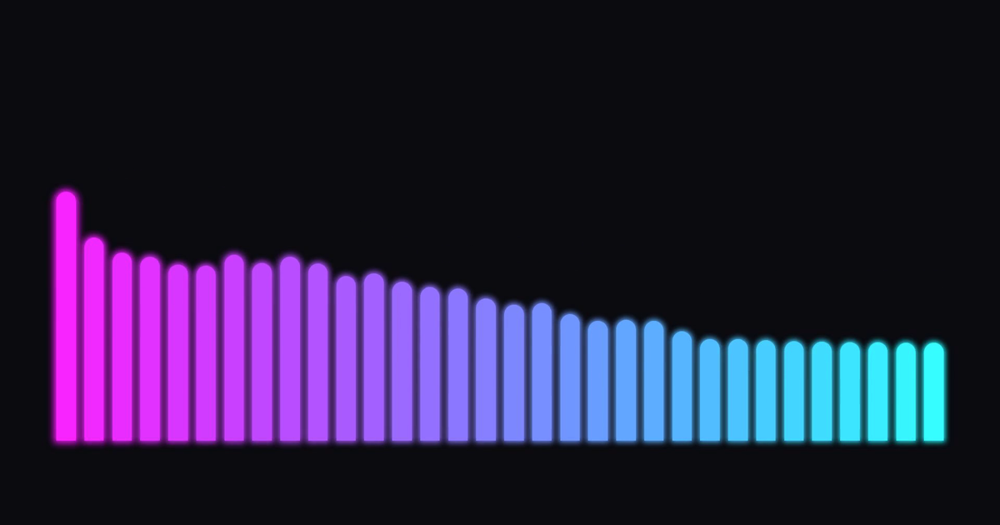](./prompt/audio-spectrum-visualizer) **[Audio Spectrum Visualizer](./prompt/audio-spectrum-visualizer)** | [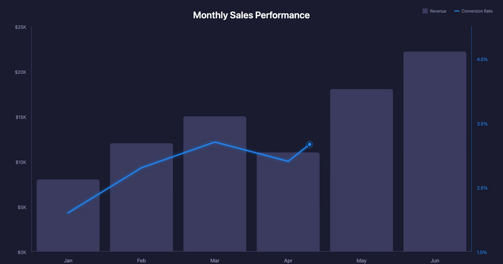](./prompt/bar-line-chart-combined) **[Bar Line Chart Combined](./prompt/bar-line-chart-combined)** |
| [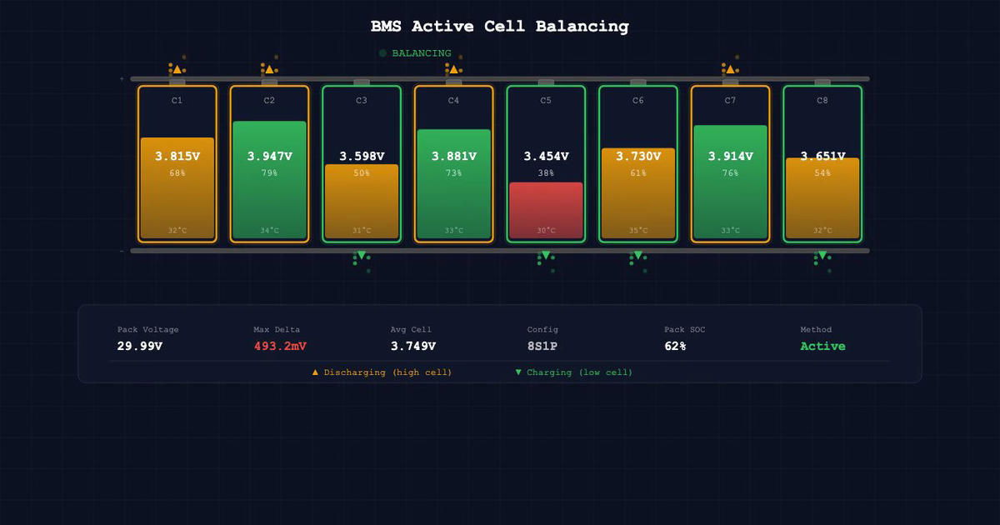](./prompt/bms-active-cell-balancing-animation-8s1p-pack-with-energy-flow-visualization) **[BMS Active Cell Balancing](./prompt/bms-active-cell-balancing-animation-8s1p-pack-with-energy-flow-visualization)** | [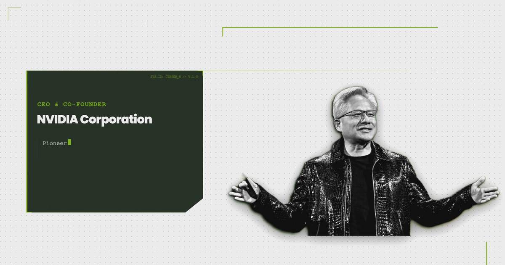](./prompt/cinematic-tech-intro) **[Cinematic Tech Intro](./prompt/cinematic-tech-intro)** |
| [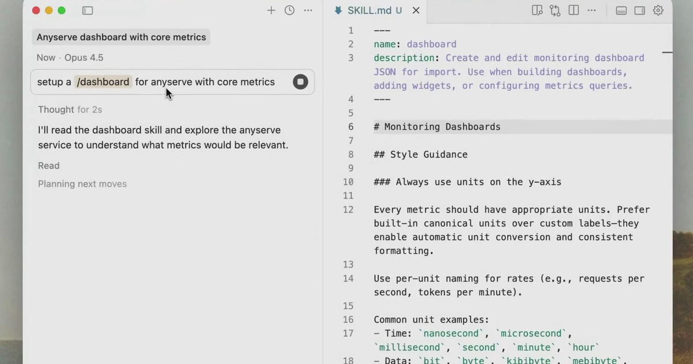](./prompt/cursor-agent-skills-announcement) **[Cursor Agent Skills Announcement](./prompt/cursor-agent-skills-announcement)** | [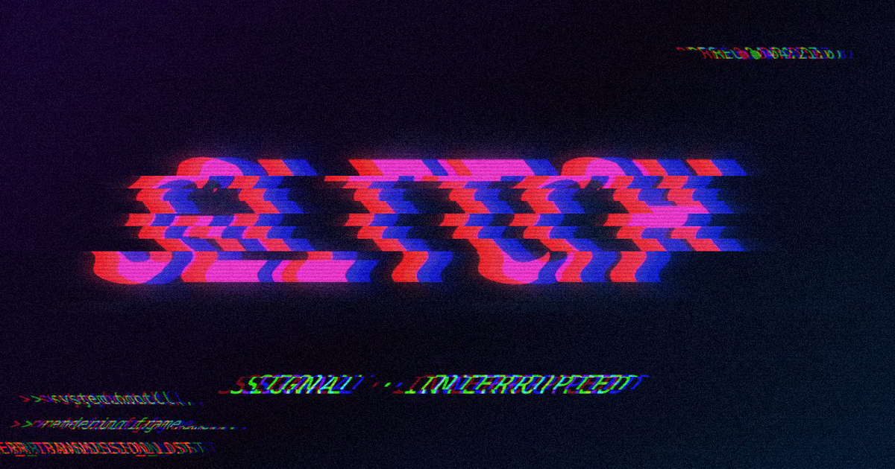](./prompt/glitch-effect-html-in-canvas) **[Glitch Effect HTML In Canvas](./prompt/glitch-effect-html-in-canvas)** |
| [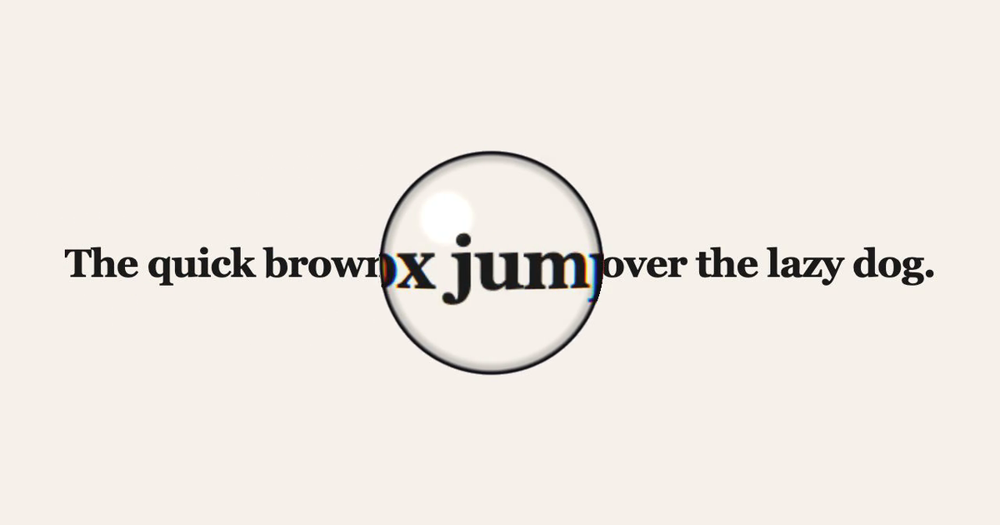](./prompt/html-in-canvas-magnifying-glass) **[HTML In Canvas Magnifying Glass](./prompt/html-in-canvas-magnifying-glass)** |  **[Launch Video On X](./prompt/launch-video-on-x)** |
| [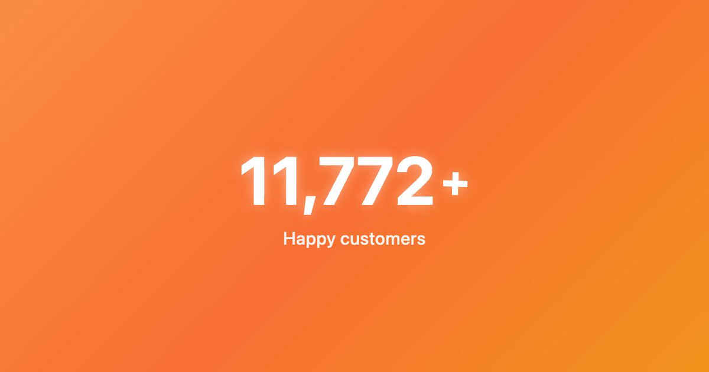](./prompt/music-cd-store-promo) **[Music CD Store Promo](./prompt/music-cd-store-promo)** |  **[News Article Headline Highlight](./prompt/news-article-headline-highlight)** |
| [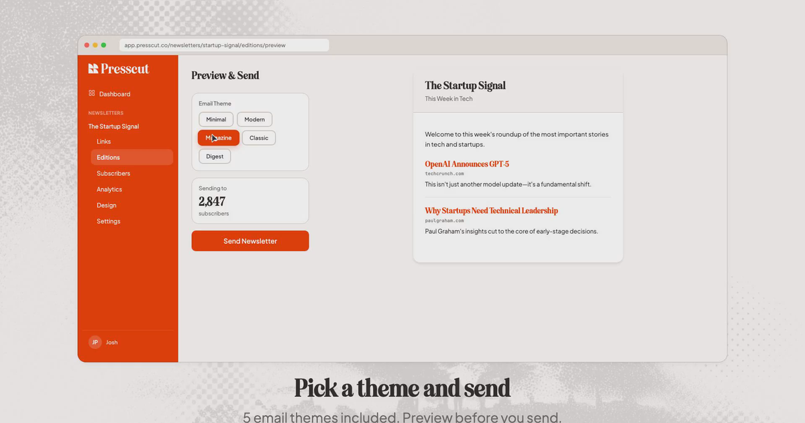](./prompt/product-demo-for-presscut) **[Product Demo For Presscut](./prompt/product-demo-for-presscut)** | [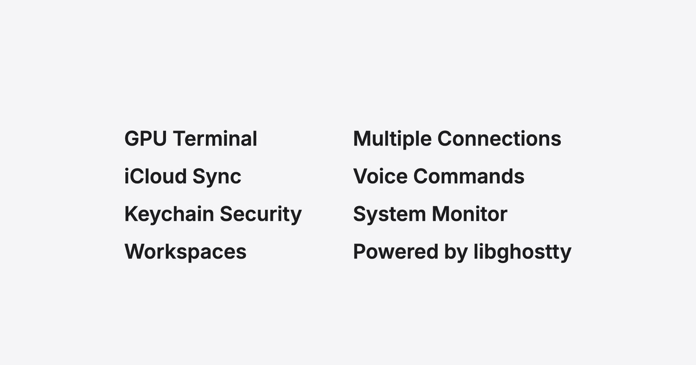](./prompt/promotion-video-for-vvterm) **[Promotion Video For Vvterm](./prompt/promotion-video-for-vvterm)** |
|  **[Real Estate Investing](./prompt/real-estate-investing)** | [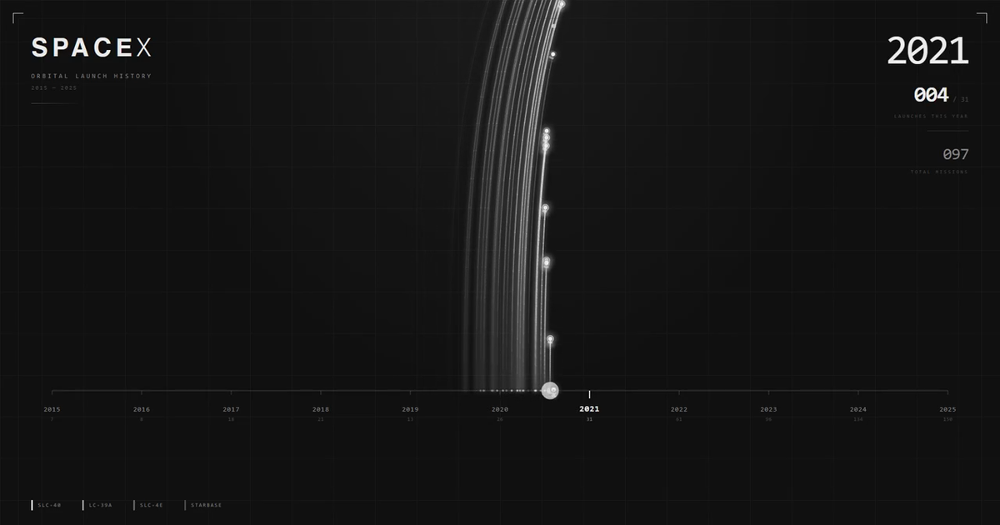](./prompt/rocket-launches-timeline) **[Rocket Launches Timeline](./prompt/rocket-launches-timeline)** |
| [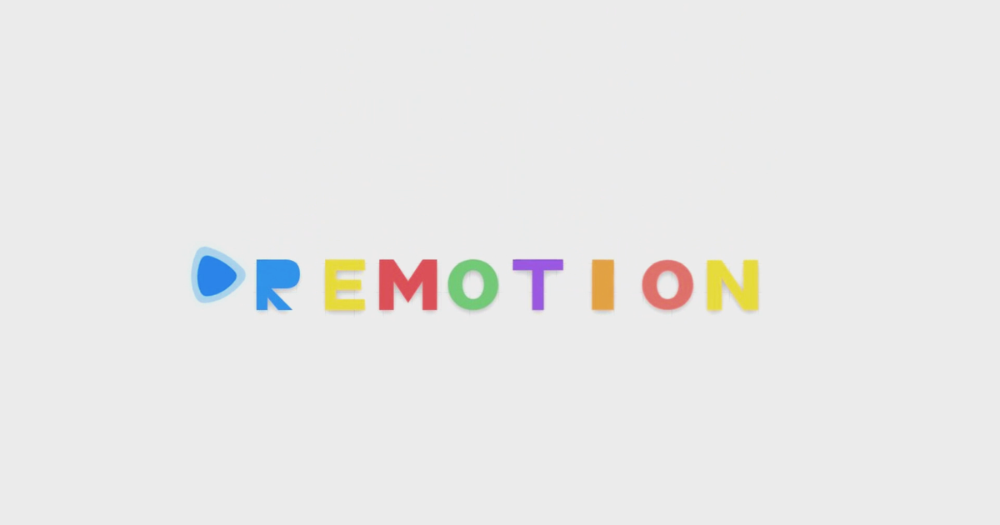](./prompt/shape-to-words-transformation) **[Shape To Words Transformation](./prompt/shape-to-words-transformation)** | [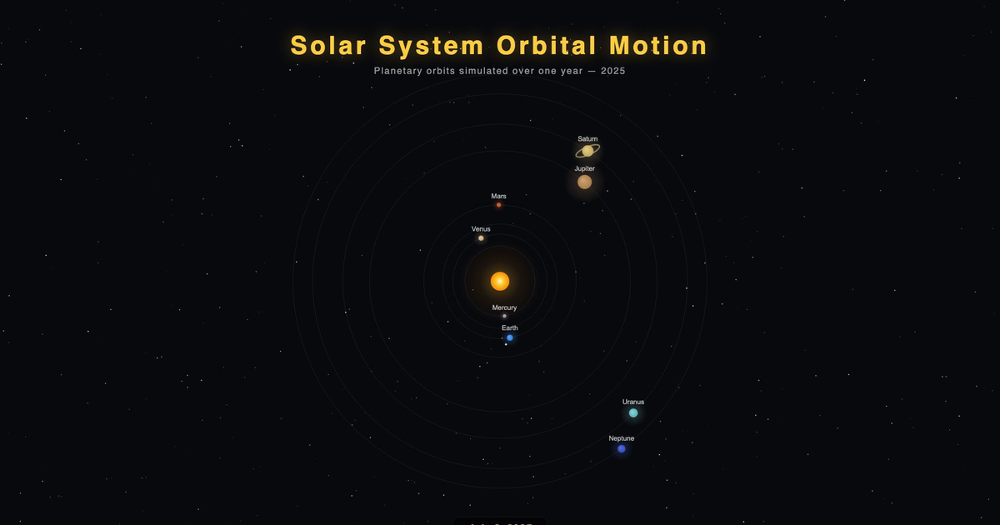](./prompt/solar-system-orbit-animation) **[Solar System Orbit Animation](./prompt/solar-system-orbit-animation)** |
| [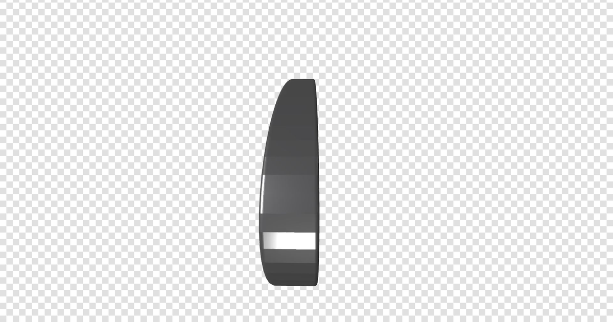](./prompt/spinning-glitching-svg-logo-turned-3d) **[Spinning Glitching SVG Logo Turned 3D](./prompt/spinning-glitching-svg-logo-turned-3d)** | [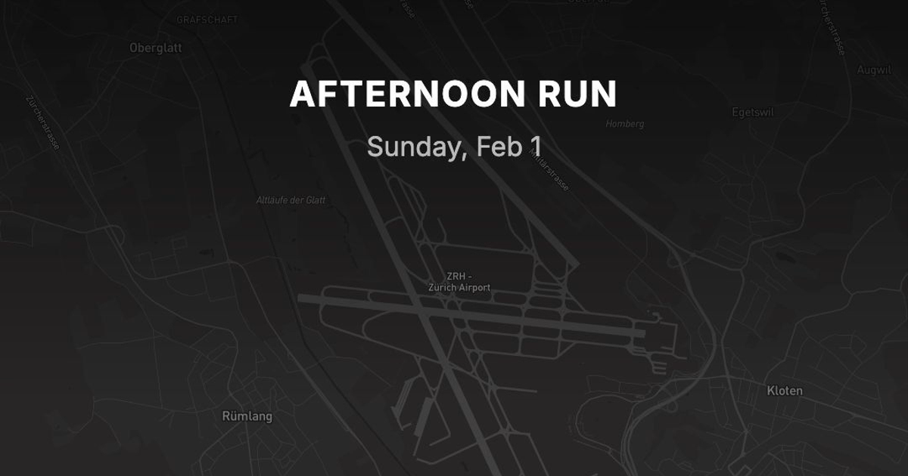](./prompt/strava-run-visualized) **[Strava Run Visualized](./prompt/strava-run-visualized)** |
|  **[The Kinetic Marketing](./prompt/the-kinetic-marketing)** | [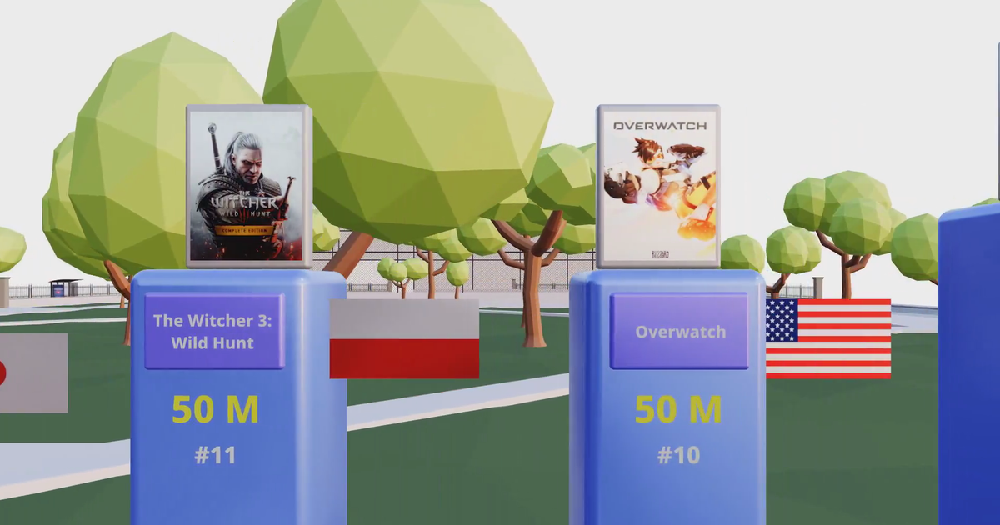](./prompt/threejs-top-20-games-sold-ranking-1) **[Threejs Top 20 Games Sold Ranking 1](./prompt/threejs-top-20-games-sold-ranking-1)** |
|  **[Transparent Call To Action Overlay](./prompt/transparent-call-to-action-overlay)** | [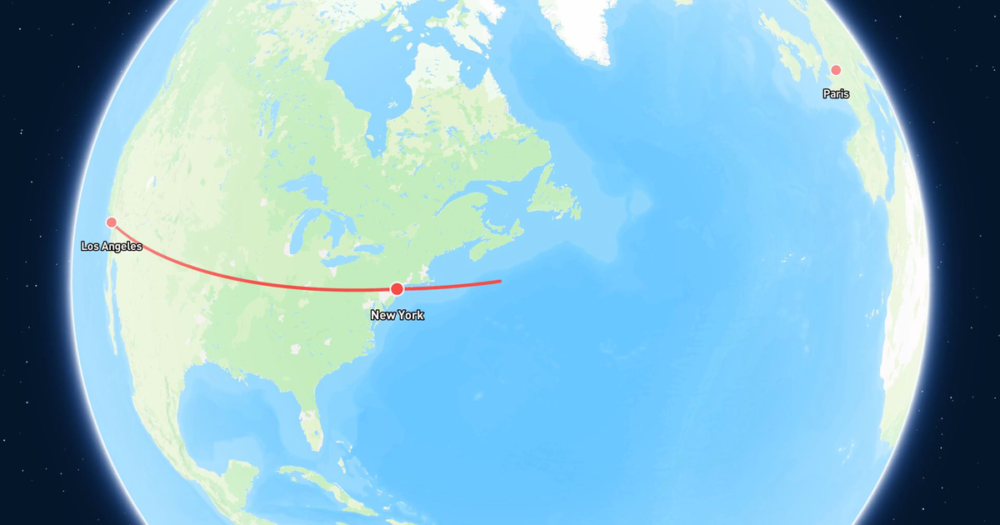](./prompt/travel-route-on-map-with-3d-landmarks) **[Travel Route On Map With 3D Landmarks](./prompt/travel-route-on-map-with-3d-landmarks)** |
| [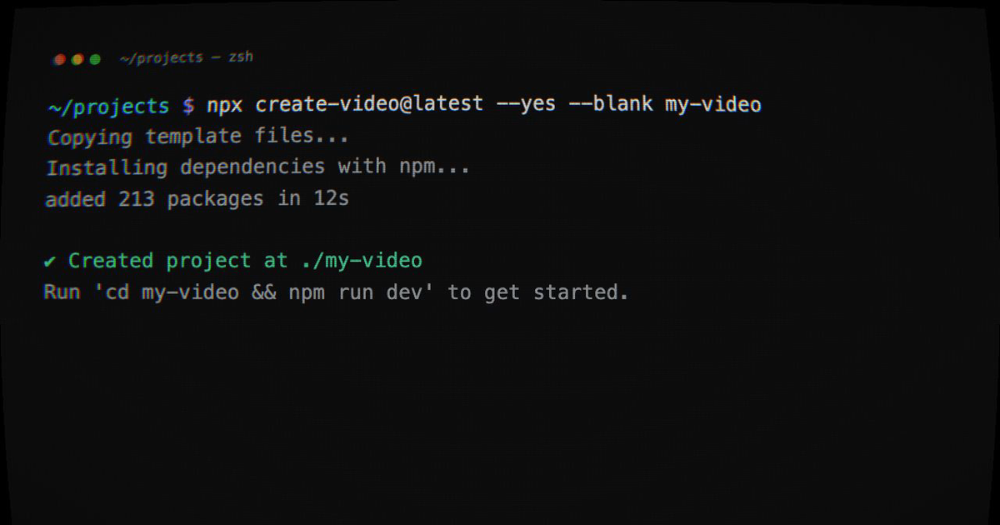](./prompt/vintage-screen-effect-html-in-canvas) **[Vintage Screen Effect HTML In Canvas](./prompt/vintage-screen-effect-html-in-canvas)** | |

 

  <i>Generated with ❤️ for AKR Developer Ecosystem</i>

